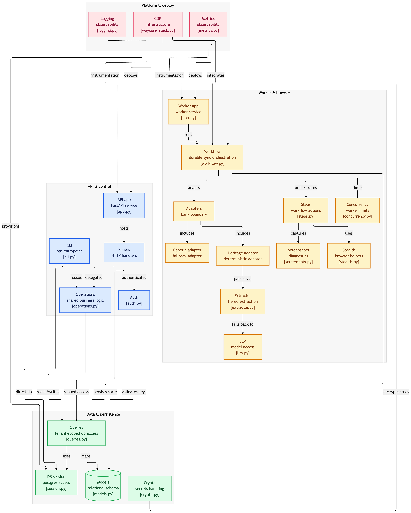

# WayCore Bank Scraper

Durable browser automation that logs into bank portals, completes OTP challenges, and extracts accounts, transactions, and balances into PostgreSQL. Survives crashes mid-sync, handles OTP pause/resume, writes idempotent data.

**Demo:** 3 accounts, 130 transactions, 3 balance snapshots from [Heritage Trust Bank](https://demo-bank-2.vercel.app) in ~60 seconds.

## Table of Contents

- [Quick Start](#quick-start)
- [Architecture](#architecture)
- [Design Decisions & Tradeoffs](#design-decisions--tradeoffs)
- [Local Setup](#local-setup)
- [AWS Deployment (CDK)](#aws-deployment-cdk)
- [Current Limits & Scaling](#current-limits--scaling)
- [LLM Providers](#llm-providers)
- [Key Environment Variables](#key-environment-variables)
- [API Reference](#api-reference)
- [Adding a New Bank](#adding-a-new-bank)
- [Project Structure](#project-structure)

## Quick Start

```bash
git clone https://github.com/mayilian/waycore-bank-scraper.git && cd waycore-bank-scraper
uv sync --extra all                   # Python deps
cp .env.example .env                  # edit: add ENCRYPTION_KEY + LLM key
docker compose up -d                  # postgres + restate + api + worker
uv run alembic upgrade head           # create tables (first time)
uv run waycore sync \
  --bank-url https://demo-bank-2.vercel.app \
  --username user --password pass --otp 123456
```

AWS deployment is separate — see [AWS Deployment (CDK)](#aws-deployment-cdk).

---

## Architecture



```
API (FastAPI) ──→ Restate (durable workflow) ──→ Worker (Playwright + LLM) ──→ PostgreSQL
     ↑                                                                              ↑
  Tenant auth                                                              Idempotent writes
  (API key)                                                               (ON CONFLICT DO NOTHING)
```

**Two app services, one image, plus Restate for orchestration:**
- **API** (port 8000): Creates connections, triggers syncs, returns data. No browser. 256MB RAM.
- **Worker** (port 9000): Runs Playwright, drives browsers, extracts data. 2GB RAM.
- **Restate**: Durable workflow engine. Journals every step, replays on crash.

### Workflow

```
Browser #1 (login)       → login, OTP, capture session cookies
Browser #2 (extract_all) → restore session, discover accounts,
                           extract txns + balance for ALL accounts
(no browser) finalise    → mark job complete
```

**2 browser launches per sync** regardless of account count. Restate journals each step — if the worker crashes, replay resumes from the last checkpoint.

### Tiered Extraction

```
Tier 1 — Deterministic DOM    Known selectors. Zero LLM cost. Sub-second.
         ↓ (selector miss)
Tier 2 — LLM text fallback    DOM summary → LLM → JSON. ~2K tokens.
         ↓ (ambiguous DOM)
Tier 3 — LLM vision           DOM + screenshot → LLM. Handles anything.
```

Heritage adapter runs Tier 1 in the happy path. LLM is never instantiated unless a fallback triggers.

---

## Design Decisions & Tradeoffs

### Problems solved

| Problem | Solution | Why it matters |
|---|---|---|
| **Browser launches are expensive** (2-4s cold start, 200MB+ each) | 2 browsers per sync regardless of account count. Login gets its own browser (OTP pause/resume requires it). All account extraction shares one browser session. | A naive "1 browser per account" design would cost 10s+ and 2GB+ for a 10-account bank. This keeps it flat at ~400MB and ~20s for the browser phase. |
| **LLM calls are slow and expensive** | Tiered extraction: deterministic DOM selectors first, LLM only as fallback. Per-goal focused prompts (not one mega-prompt). Task-specific DOM observers strip irrelevant HTML before sending to LLM. | Heritage Bank demo runs at zero LLM cost. When LLM does trigger, each call sees only the relevant DOM slice (~2K tokens vs ~50K for full page). |
| **Bank scraping is inherently flaky** | Restate durable workflows journal every step. Crash mid-extraction → restart from last checkpoint, not from login. Per-account `AccountSyncResult` tracking enables partial success. | A 30-minute sync that crashes at account #9 of 10 doesn't lose the first 8. Failed accounts are retried independently. |
| **OTP requires human-in-the-loop** | Restate `ctx.promise()` suspends the workflow with zero resources held. No browser open, no memory consumed while waiting. CLI or API sends the OTP code, workflow resumes. | Webhook OTP can wait minutes/hours. Holding a browser open during that time is wasteful and fragile. |
| **Money precision** | `NUMERIC(20,4)` + Python `Decimal` everywhere. No floats. | IEEE 754 floating point loses precision on currency. $0.10 + $0.20 ≠ $0.30 in float math. |
| **Credential security** | MultiFernet encryption at rest. Decrypt only in worker memory. Key rotation via `ENCRYPTION_KEY_PREVIOUS` — no downtime, no re-encryption migration needed. Never logged, never in API responses. | Credentials in plaintext in a database is a compliance and security failure. MultiFernet makes rotation zero-downtime. |
| **Duplicate data on re-sync** | `ON CONFLICT (account_id, external_id) DO NOTHING` on all transaction inserts. Balances are append-only (never UPDATE). | Re-running a sync is safe. No duplicate transactions, no overwritten balance history. |
| **Multi-tenant data isolation** | All queries scoped by `user_id` via `src/db/queries.py`. No raw `select(Model)` in API routes. API keys SHA-256 hashed + `hmac.compare_digest` for timing safety. | App-level tenant isolation prevents data leakage. Timing-safe comparison prevents key enumeration. |
| **Per-bank rate limiting** | Two-layer `asyncio.Semaphore`: global max browsers (`MAX_CONCURRENT_SYNCS=5`) + per-bank max (`MAX_CONCURRENT_PER_BANK=3`). | Banks rate-limit or block IPs on parallel logins. Without this, 10 concurrent syncs to the same bank would get IP-banned. |

### Tradeoffs accepted

| Tradeoff | Chose | Over | Rationale |
|---|---|---|---|
| **Extraction strategy** | Deterministic selectors with LLM fallback | Pure LLM for everything | 10x faster, zero cost for known banks. LLM still handles unknown banks via `GenericBankAdapter`. |
| **Browser sessions** | 2 browsers per sync (login + extract_all) | 1 browser for everything | Login needs its own session for OTP pause/resume. Could be 1 if OTP weren't a requirement, but it is. |
| **Restate deployment** | Single self-hosted instance | Restate Cloud or distributed | Simpler, cheaper, sufficient for current scale. Restate single-node handles thousands of concurrent workflows. |
| **Worker scaling** | Fargate Spot (80%) + on-demand base (20%) | All on-demand | 60-70% cost savings. Spot interruptions are fine — Restate replays from the last checkpoint. |
| **CDK split** | Two stacks (Foundation + App) | Single stack | Solves ECR chicken-and-egg: Foundation creates repos, images get pushed, then App creates services that pull them. |
| **DB connection pooling** | SQLAlchemy async pool (configurable) + RDS Proxy support | PgBouncer sidecar | Fewer moving parts. RDS Proxy handles connection multiplexing in production. Toggle with `USE_RDS_PROXY=true`. |
| **Screenshot storage** | Local filesystem (dev) / S3 (prod) | Always S3 | Local is simpler for dev. S3 with 30-day lifecycle for prod — failure screenshots auto-expire. |

---

## Local Setup

Supports macOS and Linux. Commands assume a POSIX shell (Windows: use WSL2).

**Prerequisites:** [Docker](https://docs.docker.com/get-docker/) (with Compose), Python 3.12+, [uv](https://docs.astral.sh/uv/getting-started/installation/)

Docker runs Postgres, Restate, API, Worker, and the browser inside the Worker container. Host-side Python is needed for the CLI, migrations, and tests.

```bash
git clone https://github.com/mayilian/waycore-bank-scraper.git
cd waycore-bank-scraper
uv sync --extra all
```

Create `.env` (LLM key only needed if Tier 2/3 fallback triggers — see [LLM Providers](#llm-providers)):
```bash
ENCRYPTION_KEY=$(uv run python3 -c "from cryptography.fernet import Fernet; print(Fernet.generate_key().decode())")

cat > .env << EOF
ENCRYPTION_KEY=$ENCRYPTION_KEY
LLM_PROVIDER=anthropic
ANTHROPIC_API_KEY=your-key-here
EOF
```

Start services and run a sync:
```bash
docker compose up -d                # postgres + restate + worker + api
uv run alembic upgrade head         # create database tables (first time only)
uv run waycore sync \
  --bank-url https://demo-bank-2.vercel.app \
  --username user --password pass --otp 123456
```

### Inspect results

The API runs at `http://localhost:8000`. Generate a key, then query:

```bash
uv run waycore create-api-key --name test
# ✓ API key created: wc_DP3o_twmKxjj5MD9i4tUaakJEEhbbhOVDCfVnAK5ZbQ

export KEY=wc_DP3o_...  # your key from above

curl http://localhost:8000/v1/accounts                          -H "Authorization: Bearer $KEY"
curl http://localhost:8000/v1/accounts/ACCOUNT_ID                -H "Authorization: Bearer $KEY"
curl http://localhost:8000/v1/accounts/ACCOUNT_ID/balances       -H "Authorization: Bearer $KEY"
curl http://localhost:8000/v1/transactions?account_id=ACCOUNT_ID -H "Authorization: Bearer $KEY"
curl http://localhost:8000/v1/jobs                               -H "Authorization: Bearer $KEY"
```

Full API reference below — see [API Reference](#api-reference). Interactive docs at `http://localhost:8000/docs` (Swagger UI).

**Dev CLI** (talks directly to Postgres — no auth, no API server needed):

```bash
uv run waycore accounts       # list synced accounts
uv run waycore transactions   # list recent transactions
uv run waycore jobs           # list sync jobs
```

### Tests

```bash
# Unit tests (no dependencies)
uv run pytest tests/unit_tests/ -v

# Integration tests (requires running Postgres — docker compose up -d first)
uv run pytest tests/integration/ -v

# All tests
uv run pytest tests/ -v

# Lint + type check
uv run ruff check src/ cli.py tests/ scripts/
uv run mypy src/ cli.py
```

Integration tests create isolated tenants per test, so they're safe to run against your local database without affecting existing data.

### Stop

```bash
docker compose down
```

---

## AWS Deployment (CDK)

Two CDK stacks: **Foundation** (VPC, RDS, ECR, S3, Secrets, Restate) and **App** (API + Worker Fargate services). Full infrastructure defined in `deploy/cdk/waycore_stack.py`.

**Prerequisites:** AWS CLI, Node.js (CDK CLI), Docker with `--platform linux/arm64` support (native on Apple Silicon, emulated on x86), [Session Manager plugin](https://docs.aws.amazon.com/systems-manager/latest/userguide/session-manager-working-with-install-plugin.html).

| Component | Spec |
|---|---|
| **API** | Fargate, ARM64, 0.25 vCPU / 512 MB, behind ALB |
| **Worker** | Fargate Spot + on-demand base, 1 vCPU / 2 GB |
| **Restate** | Fargate, 0.5 vCPU / 1 GB |
| **Database** | RDS PostgreSQL 16, db.t4g.micro, encrypted |
| **Service mesh** | Cloud Map (`*.waycore.local`) for private DNS |

```bash
# 1. Deploy Foundation (VPC, RDS, ECR repos, S3, Restate)
cd deploy/cdk && pip install -r requirements.txt
cdk deploy WayCoreFoundation -c account=ACCOUNT_ID -c region=us-east-1

# 2. Build and push Docker image (same image serves both API and Worker)
ACCOUNT=YOUR_ACCOUNT_ID REGION=us-east-1 TAG=$(git rev-parse --short HEAD)
aws ecr get-login-password --region $REGION | \
  docker login --username AWS --password-stdin $ACCOUNT.dkr.ecr.$REGION.amazonaws.com
docker build --platform linux/arm64 -t waycore:$TAG .
for repo in waycore-api waycore-worker; do
  docker tag waycore:$TAG $ACCOUNT.dkr.ecr.$REGION.amazonaws.com/$repo:$TAG
  docker push $ACCOUNT.dkr.ecr.$REGION.amazonaws.com/$repo:$TAG
done

# 3. Deploy App (API + Worker Fargate services)
cdk deploy WayCoreApp -c account=ACCOUNT_ID -c region=us-east-1

# Teardown (App first, then Foundation — removes everything)
cdk destroy WayCoreApp && cdk destroy WayCoreFoundation
```

Secrets (`ENCRYPTION_KEY`, LLM API key) go in AWS Secrets Manager (`waycore/secrets`). Migrations run via `alembic upgrade head` on the worker. Worker registration with Restate happens via ECS exec. See `deploy/cdk/` for full details.

---

## Current Limits & Scaling

**Single worker** (current deployment): 5 concurrent browser sessions, 3 per bank.

| Sync frequency | Users supported | Monthly cost (Fargate) |
|---|---|---|
| 1 sync/day per user | ~4,000 users | ~$50 |
| 8 syncs/day (business hours) | ~500 users | ~$50 |
| Burst (all sync within 30 min) | ~160 users | ~$50 |

The API is not the bottleneck — FastAPI handles thousands of req/s. Only the worker is constrained: each sync holds a Chromium browser for ~60s.

**Horizontal scaling is a config change, not a code change:**

```
                                    ┌─ Worker 1 (5 browsers)
API → Restate (queue + journal) ──→ ├─ Worker 2 (5 browsers)
                                    └─ Worker N (5 browsers)
```

- Restate distributes workflows across all registered workers automatically
- Each worker independently enforces its own concurrency limits
- Throughput scales linearly: N workers ≈ N x 4,000 syncs/day
- Adding workers requires only a CDK `desired_count` change and an auto-scaling policy

Currently hardcoded at `desired_count=1`. Auto-scaling (target: pending jobs per worker) and scale-to-zero are supported by the architecture but not yet configured — they would be the next step when load demands it.

**Cost at scale** (Fargate Spot, ARM64):

| Workers | Syncs/day | Monthly cost |
|---|---|---|
| 1 | ~4,000 | ~$50 |
| 3 | ~12,000 | ~$130 |
| 10 | ~40,000 | ~$400 |

Fargate Spot (80% of capacity) saves 60-70% vs on-demand. Spot interruptions are safe — Restate replays from the last checkpoint.

---

## LLM Providers

| Provider | Config | Notes |
|---|---|---|
| Anthropic (default) | `LLM_PROVIDER=anthropic` + `ANTHROPIC_API_KEY` | Direct API |
| Amazon Bedrock | `LLM_PROVIDER=bedrock` + `AWS_REGION` | Uses IAM credentials, no API key |
| OpenAI | `LLM_PROVIDER=openai` + `OPENAI_API_KEY` | GPT-4o |

---

## Key Environment Variables

| Variable | Default | Description |
|---|---|---|
| `DATABASE_URL` | `postgresql+asyncpg://...localhost...` | Postgres connection |
| `ENCRYPTION_KEY` | (required) | Fernet key for credentials |
| `ENCRYPTION_KEY_PREVIOUS` | `""` | Old key during rotation |
| `LLM_PROVIDER` | `anthropic` | `anthropic`, `bedrock`, or `openai` |
| `ANTHROPIC_API_KEY` / `OPENAI_API_KEY` | `""` | Required if LLM fallback triggers |
| `RESTATE_INGRESS_URL` | `http://localhost:8080` | Restate endpoint |
| `MAX_CONCURRENT_SYNCS` | `5` | Global browser session limit per worker |
| `MAX_CONCURRENT_PER_BANK` | `3` | Per-bank concurrency limit |
| `MAX_SYNC_DURATION_SECS` | `600` | Sync timeout |
| `LOG_LEVEL` | `INFO` | Logging level |
| `SCREENSHOT_BACKEND` | `local` | `local` or `s3` |

Full list in `src/core/config.py`.

---

## API Reference

All endpoints require `Authorization: Bearer <api_key>` header. All data is tenant-scoped — each API key only sees its own data.

### Connections

| Method | Endpoint | Description |
|---|---|---|
| `POST` | `/v1/connections` | Register bank credentials (encrypted at rest) |
| `GET` | `/v1/connections` | List all bank connections |
| `GET` | `/v1/connections/{id}` | Get a single connection |
| `DELETE` | `/v1/connections/{id}` | Remove connection and all its data (cascades) |

### Syncs

| Method | Endpoint | Description |
|---|---|---|
| `POST` | `/v1/connections/{id}/sync` | Trigger a sync (returns `job_id`, 202 Accepted) |
| `GET` | `/v1/jobs` | List sync jobs (`?limit=20&offset=0`) |
| `GET` | `/v1/jobs/{id}` | Job detail with step-by-step breakdown |
| `POST` | `/v1/jobs/{id}/otp` | Send OTP code to a paused webhook-mode sync |

### Accounts & Data

| Method | Endpoint | Description |
|---|---|---|
| `GET` | `/v1/accounts` | List all discovered accounts |
| `GET` | `/v1/accounts/{id}` | Get a single account |
| `GET` | `/v1/accounts/{id}/balances` | Balance history (append-only snapshots, `?limit=50&offset=0`) |
| `GET` | `/v1/transactions` | List transactions (`?account_id=X&limit=50&offset=0`) |

### Health

| Method | Endpoint | Description |
|---|---|---|
| `GET` | `/healthz` | Health check (no auth required) |

---

## Adding a New Bank

1. Create `src/adapters/<slug>_adapter.py` implementing `BankAdapter`
2. Register in `ADAPTER_REGISTRY` in `src/adapters/__init__.py`
3. Unknown URLs automatically use `GenericBankAdapter` (full LLM)

---

## Project Structure

```
cli.py                  Dev CLI: sync, inspect data, create API keys (not a product surface)
src/
  api/                  FastAPI app: connections, syncs, accounts, transactions
    auth.py             API key auth → TenantContext (SHA-256 + hmac)
    schemas.py          Pydantic request/response models
    routes/             Thin route handlers → operations.py + queries.py
  adapters/             BankAdapter ABC + per-bank implementations
    heritage_bank_adapter.py   Demo bank: deterministic selectors + LLM fallback
    heritage_parsers.py        Pure parsing functions (no browser)
    generic_bank_adapter.py    LLM-driven adapter for unknown banks
  agent/
    llm.py              LLMClient protocol + providers (Anthropic, Bedrock, OpenAI)
    extractor.py        Per-goal LLM extraction with task-specific DOM observers
  browser/
    stealth.py          Playwright launch + stealth + bezier mouse
    screenshots.py      Screenshot capture (local or S3)
  core/
    config.py           pydantic-settings (all env vars)
    crypto.py           MultiFernet encrypt/decrypt with key rotation
    logging.py          structlog JSON + context binding
    metrics.py          CloudWatch EMF metric emitter
    urls.py             URL normalization
  services/
    operations.py       Shared business logic (CLI + API both call this)
  db/
    models.py           SQLAlchemy models (Organization → User → ApiKey → BankConnection → ...)
    queries.py          Tenant-scoped query helpers
    session.py          Async session factory (RDS Proxy aware)
  worker/
    app.py              Restate ASGI app
    workflow.py         Durable workflow: login → extract_all → finalise
    steps.py            Step functions with batched DB writes
    concurrency.py      Global + per-bank concurrency limiter
deploy/cdk/
  stacks/
    foundation_stack.py VPC, RDS, ECR, S3, Secrets, Restate
    app_stack.py        API + Worker Fargate services
alembic/                Database migrations
tests/
  unit_tests/           Mirrors src/ layout — no external dependencies
    adapters/           Adapter + parser tests
    agent/              Extractor tests
    core/               Crypto, URL, config tests
    db/                 Model tests
    worker/             Failure mode, concurrency, trigger tests
  integration/          API tests — requires running PostgreSQL
```
